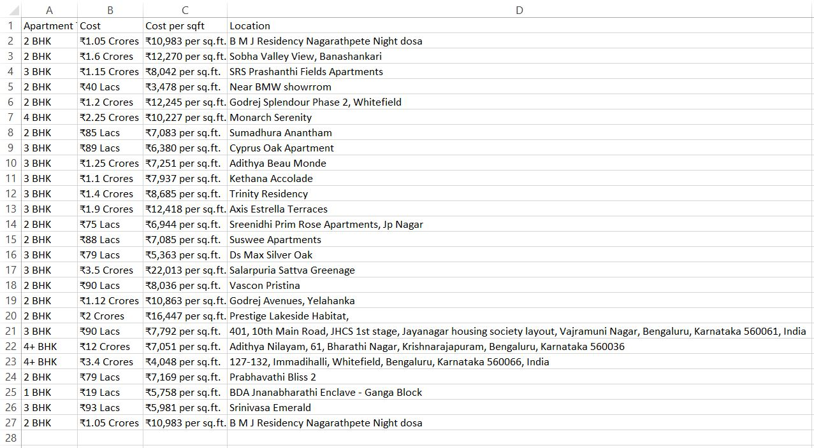

# Real Estate Insight Automation  

## Overview  
**Real Estate Insight Automation** is an RPA (Robotic Process Automation) project implemented using **UiPath** to automate data scraping, processing, and reporting for real estate properties. This workflow extracts essential details like property type (e.g., 2BHK/3BHK), cost, location, and more from real estate websites and generates an Excel sheet for easy analysis.  

---

## Implementation  

### Workflow Steps  
1. **Open UiPath Studio:**  
   Begin by creating a new process and naming it *Housing List Excel Automation*.  

2. **Sequence Activity:**  
   - Add a `Sequence` activity, labeled as **Sequence - Scrape Real Estate Data and Generate Excel Sheet**.  
   - Annotate this step to describe its purpose: "Scrapes data from a real estate website, processes it, and generates an Excel sheet with relevant details."  

3. **Try-Catch Activity:**  
   - Insert a `Try Catch` activity to handle errors gracefully.  
   - In the **Try** section:  
     - Use `Open Browser` to navigate to the real estate website.  
     - Add an annotation: "This activity opens the specified real estate website."  

4. **Data Scraping Activity:**  
   - Configure `Data Scraping` to extract property details (e.g., type, cost, location).  
   - Annotate: "This activity scrapes property details like 2BHK/3BHK, cost, and location."  
   - Store the scraped data in a variable `ExtractDataTable` of type `Data Table`.  

5. **Write Data to Excel:**  
   - Use `Write CSV` activity to save the scraped data into an Excel sheet.  
   - Annotate: "This activity writes the scraped data to an Excel sheet."  

6. **Completion Message:**  
   - Add a `Message Box` to display a success message:  
     > Housing list has been successfully generated in the Excel sheet.  

7. **Error Handling:**  
   - In the **Catch** section of `Try Catch`:  
     - Use `Assign` activity to save the exception message.  
     - Use a `Message Box` to display the error message.  

---

## Modules and Their Roles  

### Sequence: Scrape Real Estate Data and Generate Excel Sheet  
This module serves as the primary container for the workflow, organizing the activities to scrape property details and generate an output Excel file.  

### Try Catch: Error Handling  
Handles exceptions efficiently, ensuring smooth execution and error reporting.  

### Data Scraping: Extract Property Details  
Extracts essential details like property type, cost, and location from the target website.  

### Write CSV: Save Data to Excel  
Writes the scraped data into an organized Excel sheet for further analysis.  

### Message Box: Completion Message  
Indicates the successful completion of the workflow.  

---

## Screenshots  

### 1. Open Real Estate Website  

  

### 2. Data Scraping - Extract Property Details  
 
  

### 3. Write Property Data to Excel  
 
  

### 4. Completion Message  

  

### 5. Catch Block Activity  

  

---

## How to Run the Workflow  

1. **Prerequisites:**  
   - Install UiPath Studio.  
   - Ensure the target real estate website is accessible.  

2. **Steps to Execute:**  
   - Open the workflow in UiPath Studio.  
   - Configure the real estate website URL in the `Open Browser` activity.  
   - Run the workflow by clicking the **Run** button in UiPath Studio.  
   - Upon completion, an Excel sheet will be generated with the scraped property details.  

---

## Results  
- The workflow successfully scrapes property details from the real estate website.  
- Generates an organized Excel sheet with property type, cost, and location.  
- Displays a success message or error details based on execution status.  

---

## Output  

### 1. Extraction of Real Estate Data  

  

### 2. Message Box indicating the completion of the process 
 
  

---

## Future Enhancements  
1. Add support for multiple real estate websites.  
2. Include filtering options for property preferences.  
3. Enhance error handling with detailed logs.  
4. Automate email notifications with the generated Excel sheet as an attachment.

---

## Project Associates
- Sinchana Poojary
- Sreevalli R
- Umme Ayman Khanam
- Varun S Hatti
